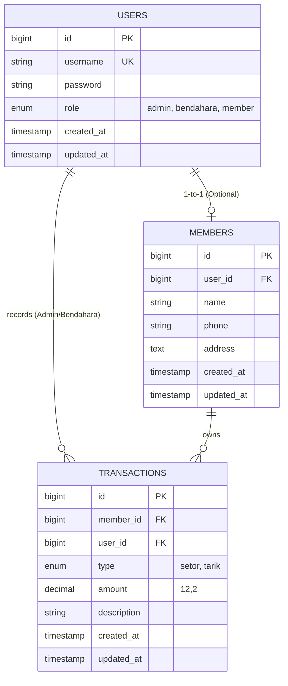

<div align="center">

# 💰 APLIKASI KEUANGAN & TABUNGAN PKK
### *Product Requirement Document (PRD) & Technical Documentation*

[](https://laravel.com)
[](https://php.net)
[](https://mysql.com)
[](https://tailwindcss.com)
[](LICENSE)

---
*Sistem Informasi Manajemen Keuangan dan Tabungan Pemberdayaan Kesejahteraan Keluarga (PKK) Berbasis Web.*
</div>

---

## 📋 DAFTAR ISI
1. [📌 1. Ringkasan Produk (*Product Overview*)](#-1-ringkasan-produk-product-overview)
2. [👥 2. Role & Hak Akses (RBAC)](#-2-role--hak-akses-role-based-access-control--rbac)
3. [⚙️ 3. Spesifikasi Fitur & Alur Kerja](#%EF%B8%8F-3-spesifikasi-fitur--alur-kerja-functional-requirements)
4. [🗄️ 4. Arsitektur Data & Skema Database](#%EF%B8%8F-4-arsitektur-data--skema-database)
5. [🌐 5. Rancangan Endpoint API & Routing](#-5-rancangan-endpoint-api--routing-laravel-pattern)
6. [🖥️ 6. Mockup Wireframe Tampilan](#%EF%B8%8F-6-mockup-wireframe-tampilan-text-based-ui)
7. [🛠️ 7. Teknologi & Lingkungan Pengembangan](#%EF%B8%8F-7-teknologi--lingkungan-pengembangan)

---

## 📌 1. RINGKASAN PRODUK (*PRODUCT OVERVIEW*)

### 1.1 Latar Belakang
Pencatatan tabungan dan kas Pemberdayaan Kesejahteraan Keluarga (PKK) pada tingkat RT/RW sering kali masih dilakukan secara manual menggunakan buku fisik. Metode konvensional ini memiliki beberapa kelemahan mendasar:

* ⚠️ **Risiko Kehilangan & Kerusakan Data:** Buku fisik rentan rusak, terselip, atau basah.
* ❌ **Potensi Human Error:** Perhitungan saldo harian/bulanan manual rawan kesalahan aritmatika.
* 🔒 **Keterbatasan Aksesibilitas & Transparansi:** Anggota PKK sulit mengecek saldo mutasi secara mandiri kapan saja tanpa harus menanyakan langsung ke bendahara.

### 1.2 Tujuan Produk
Membangun **Sistem Informasi Pencatatan Tabungan & Keuangan PKK berbasis Web** yang:
* 🎯 **Akurat & Real-time:** Menghitung saldo serta riwayat mutasi secara otomatis dan akurat.
* 🛡️ **Aman & Terkontrol:** Menerapkan pembatasan hak akses berdasar peran (*Role-Based Access Control*).
* 👁️ **Transparan:** Memberikan akses langsung kepada anggota untuk melihat posisi saldo dan riwayat transaksi pribadi.
* 📱 **Multi-device:** Mudah diakses melalui HP (*smartphone*) maupun laptop/komputer.

---

## 👥 2. ROLE & HAK AKSES (*ROLE-BASED ACCESS CONTROL / RBAC*)

Aplikasi ini mendefinisikan **3 Peran Utama** pengguna dengan hak akses sebagai berikut:

| Peran (*Role*) | Deskripsi | Hak Akses Utama |
| :---: | :--- | :--- |
| **`Admin`** | Pengelola Sistem Utama | • Mengelola seluruh akun pengguna (`users`)<br>• Mengubah role `Member` menjadi `Bendahara` (Promosi Role)<br>• Mengelola Master Data Anggota (`members`)<br>• Melakukan input transaksi (Setor & Tarik)<br>• Melihat seluruh laporan kas & tabungan |
| **`Bendahara`** | Pengurus Operasional | • Mengelola Data Anggota (CRUD)<br>• Input transaksi (Setor & Tarik)<br>• Melihat laporan & rekapitulasi kas PKK<br>• *Tidak memiliki hak mengelola role/akun pengurus lain* |
| **`Member`** | Anggota PKK | • Registrasi akun mandiri (*Self-Register*)<br>• Mengedit data profil pribadi<br>• Melihat saldo tabungan pribadi secara real-time<br>• Melihat riwayat mutasi transaksi pribadi |

---

## ⚙️ 3. SPESIFIKASI FITUR & ALUR KERJA (*FUNCTIONAL REQUIREMENTS*)

### 3.1 Modul Autentikasi & Akun

#### 🔑 `FR-01` Registration (Self-Register)
* **Akses:** Publik (Calon Member).
* **Input Form:** Nama Lengkap, Username, Password, No. WhatsApp, Alamat / RT.
* **Aturan Bisnis:** 
  * Role pengguna otomatis terkunci menjadi `member`.
  * `username` bersifat unik (tidak boleh duplikat).

#### 🔑 `FR-02` Login & Authentication
* **Akses:** Semua Role (`Admin`, `Bendahara`, `Member`).
* **Input Form:** Username & Password.
* **Output:** Redireksi otomatis ke halaman Dashboard sesuai *Role* masing-masing.

#### 🔑 `FR-03` Manajemen User & Promosi Role *(Khusus Admin)*
* **Fitur:** Menampilkan tabel seluruh akun pengguna terdaftar.
* **Aksi:** Admin dapat mengubah `role` user dari `member` menjadi `bendahara` atau sebaliknya.

---

### 3.2 Modul Data Anggota (Members)

#### 👤 `FR-04` Master Data Anggota
* **Akses:** `Admin` & `Bendahara`.
* **Fitur Utama:**
  * **Create:** Admin atau bendahara dapat menambah anggota sekaligus membuat akun `member` baru.
  * **Read:** Melihat daftar anggota lengkap beserta status akun dan akumulasi total saldo tabungan.
  * **Update:** Memperbarui informasi data profil anggota (Nama, No. HP, Alamat).
  * **Delete:** Menghapus atau menonaktifkan status anggota.

---

### 3.3 Modul Transaksi Tabungan

#### 💸 `FR-05` Input Transaksi (Setor / Tarik)
* **Akses:** `Admin` & `Bendahara`.
* **Komponen Form:**
  1. **Pilih Anggota:** Dropdown / Searchable Select.
  2. **Jenis Transaksi:** Radio Button (`Setor` / `Tarik`).
  3. **Nominal Transaksi:** Numeric input (minimal: Rp 1.000).
  4. **Catatan / Keterangan:** Text input opsional (contoh: *"Setoran Wajib Bulanan"*).

> [!IMPORTANT]
> #### 🛑 `FR-06` Validasi Transaksi Penarikan
> * **Aturan Bisnis:** 
>   Jika Jenis Transaksi = `Tarik`, sistem wajib memvalidasi kondisi:
>   $$\text{Nominal Penarikan} > \text{Saldo Terkini Anggota}$$
> * Jika kondisi terpenuhi (saldo tidak mencukupi), transaksi **wajib ditolak** dan sistem menampilkan pesan galat:
>   > ⚠️ *"Saldo tidak mencukupi"*

---

### 3.4 Modul Laporan & Dashboard

#### 📊 `FR-07` Dashboard Statistik
* **Tampilan Admin & Bendahara (Card Widgets):**
  * 🟢 Total Kas Terkumpul
  * 📈 Total Setoran Bulan Ini
  * 📉 Total Penarikan Bulan Ini
  * 👥 Jumlah Anggota Aktif
* **Tampilan Member (Card Widgets):**
  * 💳 Total Saldo Tabungan Saya
  * 📜 Total Transaksi / Mutasi Saya

#### 📑 `FR-08` Cetak Laporan (Export PDF & Excel)
* **Akses:** `Admin` & `Bendahara`.
* **Filter Laporan:** Berdasarkan Rentang Tanggal (*Start Date* - *End Date*) dan pilihan Anggota tertentu / Semua Anggota.

---

## 🗄️ 4. ARSITEKTUR DATA & SKEMA DATABASE

### 4.1 Entity Relationship Diagram (ERD)



---

### 4.2 Detil Struktur Tabel

#### 1️⃣ Tabel `users`
| Nama Kolom | Tipe Data | Kunci / Atribut | Keterangan |
| :--- | :--- | :---: | :--- |
| `id` | `BIGINT` | `PK` `AUTO` | ID Unik Pengguna |
| `username` | `VARCHAR(50)` | `UK` `NOT NULL` | Username untuk login |
| `password` | `VARCHAR(255)` | `NOT NULL` | Password di-hash (Bcrypt) |
| `role` | `ENUM` | `NOT NULL` | `'admin'`, `'bendahara'`, `'member'` |
| `created_at` | `TIMESTAMP` | `NULL` | Tanggal pembuatan akun |
| `updated_at` | `TIMESTAMP` | `NULL` | Tanggal pembaruan akun |

#### 2️⃣ Tabel `members`
| Nama Kolom | Tipe Data | Kunci / Atribut | Keterangan |
| :--- | :--- | :---: | :--- |
| `id` | `BIGINT` | `PK` `AUTO` | ID Unik Anggota |
| `user_id` | `BIGINT` | `FK` `NULL` | Relasi ke `users.id` |
| `name` | `VARCHAR(100)`| `NOT NULL` | Nama Lengkap Anggota |
| `phone` | `VARCHAR(20)` | `NULL` | No. WhatsApp / HP |
| `address` | `TEXT` | `NULL` | Alamat Lengkap / RT |
| `created_at` | `TIMESTAMP` | `NULL` | Waktu pendaftaran |
| `updated_at` | `TIMESTAMP` | `NULL` | Waktu pembaruan data |

#### 3️⃣ Tabel `transactions`
| Nama Kolom | Tipe Data | Kunci / Atribut | Keterangan |
| :--- | :--- | :---: | :--- |
| `id` | `BIGINT` | `PK` `AUTO` | ID Unik Transaksi |
| `member_id` | `BIGINT` | `FK` `NOT NULL` | Relasi ke `members.id` (Pemilik Saldo) |
| `user_id` | `BIGINT` | `FK` `NOT NULL` | Relasi ke `users.id` (Petugas Penginput) |
| `type` | `ENUM` | `NOT NULL` | `'setor'`, `'tarik'` |
| `amount` | `DECIMAL(12,2)`| `NOT NULL` | Nominal transaksi (min: 1000) |
| `description` | `VARCHAR(255)`| `NULL` | Catatan/keterangan transaksi |
| `created_at` | `TIMESTAMP` | `NOT NULL` | Waktu transaksi dilakukan |
| `updated_at` | `TIMESTAMP` | `NULL` | Waktu data diperbarui |

---

## 🌐 5. RANCANGAN ENDPOINT API & ROUTING (LARAVEL PATTERN)

| Method | Endpoint / Route | Access / Middleware | Deskripsi Fungsi |
| :---: | :--- | :--- | :--- |
| `POST` | `/register` | `Guest` | Pendaftaran akun member baru secara mandiri |
| `POST` | `/login` | `Guest` | Autentikasi masuk pengguna ke sistem |
| `POST` | `/logout` | `Auth` | Keluar dari sesi sistem |
| `GET` | `/dashboard` | `Auth (All Roles)` | Menampilkan halaman dashboard utama sesuai role |
| `GET` | `/users` | `Middleware: role:admin` | Menampilkan daftar seluruh user & form kelola role |
| `PATCH` | `/users/{id}/role` | `Middleware: role:admin` | Mengubah role user (Promosi Member $\rightarrow$ Bendahara) |
| `GET` | `/members` | `Middleware: role:admin,bendahara` | Menampilkan master data seluruh anggota |
| `POST` | `/members` | `Middleware: role:admin,bendahara` | Menambah data anggota baru |
| `POST` | `/transactions` | `Middleware: role:admin,bendahara` | Menyimpan transaksi baru (Setoran / Penarikan) |
| `GET` | `/my-savings` | `Middleware: role:member` | Menampilkan saldo & riwayat mutasi pribadi member |
| `GET` | `/reports/export` | `Middleware: role:admin,bendahara` | Mengunduh rekapitulasi laporan dalam format PDF/Excel |

---

## 🖥️ 6. MOCKUP WIREFRAME TAMPILAN (TEXT-BASED UI)

### A. Form Transaksi Tabungan *(Khusus Admin / Bendahara)*

```text
==================================================
              FORM TRANSAKSI TABUNGAN
==================================================
Pilih Anggota    : [ Select Anggota / Cari Nama ▼ ]
Jenis Transaksi  : (o) Setor     ( ) Tarik
Nominal (Rp)     : [ 50000                      ]
Catatan          : [ Setoran Wajib Bulanan      ]

                   [   SIMPAN TRANSAKSI   ]
==================================================
```

### B. Dashboard Member *(Tampilan Saldo & Mutasi)*

```text
==================================================
HALAMAN ANGGOTA: Ibu Ani (RT 02)
==================================================
+------------------------------------------------+
| TOTAL SALDO TABUNGAN SAYA                      |
| Rp 1.250.000,-                                 |
+------------------------------------------------+

RIWAYAT MUTASI TERAKHIR:
--------------------------------------------------
Tgl        | Jenis | Nominal    | Keterangan
--------------------------------------------------
10/05/2026 | Setor | Rp 50.000  | Setoran Bulanan
01/04/2026 | Tarik | Rp 20.000  | Penarikan Sembako
--------------------------------------------------
```

---

## 🛠️ 7. TEKNOLOGI & LINGKUNGAN PENGEMBANGAN

### Catatan Implementasi
Versi yang ada di repository ini merupakan aplikasi PHP native berbasis session dan PDO,
dengan halaman server-rendered di root project. File `schema.sql` adalah schema beserta
data awal yang direkomendasikan untuk instalasi baru, sedangkan `db_tabunganpkk.sql`
merupakan dump database hasil export.

| Komponen | Teknologi Yang Digunakan | Deskripsi |
| :--- | :--- | :--- |
| **Backend Framework** | PHP 8.x + Laravel 10+ / Node.js | Core Logic & REST API / Server Rendering |
| **Database** | MySQL 8.0 / MariaDB | Relational Database Management System |
| **Frontend Styling** | Tailwind CSS / Bootstrap 5 | Responsive Mobile-First Design System |
| **Authentication** | Laravel Breeze / Session Auth | Secure User Session Management |
| **PDF Export** | `barryvdh/laravel-dompdf` | Generasi Laporan Format PDF |
| **Excel Export** | `maatwebsite/excel` | Export Data Rekapitulasi Format `.xlsx` |

---

<div align="center">

**Aplikasi Keuangan & Tabungan PKK** &copy; 2026 — Dibuat untuk Efisiensi & Transparansi Pengelolaan Kas PKK.

</div>